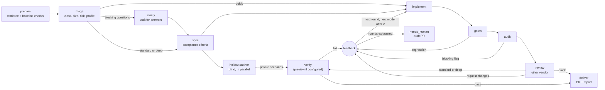

# Limitless user guide

This guide takes a new user from an empty machine to a reviewed pull request, then covers the
day-to-day: starting work, reading a run, routing, costs and operations. It describes the code on
`main` as of 2026-09-27 (commit `62867bc`). For design detail, see the maintainer docs:
[ARCHITECTURE](ARCHITECTURE.md), [OPERATIONS](OPERATIONS.md), [EVALS](EVALS.md) and
[REASONING_EFFORT](REASONING_EFFORT.md).

Contents:

1. [What Limitless is](#1-what-limitless-is)
2. [Install and first run](#2-install-and-first-run)
3. [Starting work](#3-starting-work)
4. [Reading a run](#4-reading-a-run)
5. [Models and routing](#5-models-and-routing)
6. [Costs and quotas](#6-costs-and-quotas)
7. [Operations](#7-operations)
8. [Troubleshooting FAQ](#8-troubleshooting-faq)

## 1. What Limitless is

Limitless is a personal software factory. It is a single Bun daemon with a SQLite store. You give
it a prompt and a repository. It plans the change, implements it, checks the result and delivers a
pull request with an evidence report. Implementation runs through the official `claude` and
`codex` CLIs, so your Claude and ChatGPT subscriptions do most of the work. OpenRouter and local
model servers take the roles the routing policy assigns them, such as cheap classification.

Orchestration is deterministic code. Models only do the work *inside* a stage. They never decide
which stage runs next. The implementer never grades its own work: the factory runs the checks, a
model from a different vendor (when one is available) reviews the change, and a separate session
verifies it against acceptance criteria and against scenarios the implementer never saw.

### The pipeline



Each stage and what it guarantees:

| Stage | quick | standard | deep | Guarantee |
|---|---|---|---|---|
| prepare | yes | yes | yes | A fresh git worktree from a cached clone. Gate commands come from `.limitless.toml` or are auto-detected, then run on the *base* branch, so failures that were already there are known. No model involved. |
| triage | yes | yes | yes | A cheap model classifies the task (class, complexity, risk, ambiguity) and suggests a profile. `--profile auto` uses its suggestion; an explicit profile wins. |
| clarify | no | if needed | if needed | The run pauses as `waiting_input` only when triage rates ambiguity high and has blocking questions. The spec stage can also ask questions if it still has blocking ones. |
| spec | no | yes | yes | Requirements and testable acceptance criteria (`AC-1`, `AC-2`, ...), written against the actual code. |
| holdout | no | yes | yes | A model, preferably from a different vendor than the spec author, writes concrete acceptance scenarios from the prompt and spec. It can read and search a private, read-only snapshot of the base commit (never the implementer's worktree, home or temporary directories), so its steps use real commands and config. The implementer never sees these scenarios. |
| implement | yes | yes | yes | An agent edits the worktree and each round is committed. Routing depends on task complexity. |
| gates | yes | yes | yes | The factory reruns every check. A check that passed on the base branch and now fails, or a new check that fails, blocks. Pre-existing failures do not. A failed setup step always blocks. |
| audit | yes | yes | yes | Deterministic checks on the diff. These block: an empty diff, edits to existing protected paths, new `skip`/`only` markers, tests moved out of test paths, secrets, and changed gate scripts. Deleted tests, config or CI edits, lockfile edits, suppressions, removed assertions and `--no-verify` produce warnings. |
| review | yes | yes | yes (frontier cell) | A reviewer from a different vendor than the implementer applies a rubric. It falls back to the same vendor, with a logged warning, only when nothing else is available. In the first review, blocker and major findings block. In later rounds, only regressions, unaddressed earlier blocking findings, and new blockers or security issues block. Everything else becomes a follow-up. |
| preview | no | if configured | if configured | For UI changes, builds, seeds and serves the app on loopback before verify (see `[preview]` in the [README](../README.md#configuration)). |
| verify | no | yes | yes | A separate, private session checks every acceptance criterion and holdout scenario by running things. It prefers a different vendor than the implementer. The result is a pass only when every criterion is `met`. |
| deliver | yes | yes | yes | Commit, rebase onto the latest base and rerun the checks, push, and open a PR with an evidence report. The PR is then merged or left open according to the merge policy. |

A few more details:

- **Rounds and escalation.** Any failing gate, audit, review or verify sends structured feedback to
  a new implement round. After two failing rounds on one model, the implementer escalates to a
  stronger tier (or to any model not yet tried). The total number of rounds is
  `[limits].max_rounds + 2`, which is 5 by default. When the rounds run out, the run ends as
  `needs_human` and opens a draft PR titled `[needs human] ...`.
- **Profiles today.** `quick` skips spec, holdout and verify. `deep` differs from `standard` in
  routing review to the `large` policy cell, which puts frontier models first, and in panel review
  mode it adds the repository's review lenses (see [Review configuration](#review-configuration-and-lenses)).
  ARCHITECTURE describes a plan stage and plan review, but they are not implemented.
- **Deterministic control flow.** The code, not a model, derives the review verdict from the
  findings. The model's own verdict is stored for inspection only.

## 2. Install and first run

### Prerequisites

| Tool | Why | Check |
|---|---|---|
| macOS | `service`, `deploy` and `local` use launchd. The daemon itself runs anywhere Bun runs. | — |
| [Bun](https://bun.sh) | Runtime for the daemon, CLI and UI | `bun --version` |
| git | Worktrees, commits, rebases | `git --version` |
| GitHub CLI `gh`, authenticated | Repo lookup, PR creation and merge, issue comments | `gh auth status` |
| SSH access to GitHub | Clones and pushes use the repository's SSH URL | `ssh -T git@github.com` |
| `claude` CLI, logged in | Anthropic models. It also carries OpenRouter and local models through Anthropic-compatible endpoints. | `claude --version` |
| `codex` CLI, logged in | OpenAI models on a ChatGPT subscription | `codex --version` |

Both agent CLIs are strongly recommended. Cross-vendor review and verification need two vendors.
With only one vendor, runs still complete, but reviews fall back to the same vendor and log a
warning. Optional extras: an OpenRouter API key, a local model server (see
[OPERATIONS](OPERATIONS.md#local-models)), `cloudflared` for GitHub webhooks, and a Discord bot.

### Get the code

```bash
git clone git@github.com:MattFlower/limitless.git ~/code/limitless   # or your fork
cd ~/code/limitless
bun install --frozen-lockfile
alias limitless="bun $PWD/src/cli/main.ts"   # or link the package bin onto your PATH
limitless --help
```

Most commands talk to the daemon over HTTP, so start it first. Only `serve`, `service` and
`integrations install` work without it.

### Configure

Configuration is optional and lives in `~/.config/limitless/`. Set `LIMITLESS_CONFIG_DIR` to use
another directory.

**`secrets.env`** (run `chmod 600` on it). It uses `KEY=value` lines. Quotes, a leading `export`
and `#` comments are allowed. Environment variables of the same name override the file, except for
`TWILIGHT_API_KEY` and `TYPESAFE_API_KEY`, which are read only from the file.

| Key | Enables |
|---|---|
| `OPENROUTER_API_KEY` | The `openrouter` provider. Without it, the provider shows `missing OPENROUTER_API_KEY`. |
| `TWILIGHT_API_KEY` | The `twilight` provider (LAN llama.cpp server) |
| `TYPESAFE_API_KEY` | The `typesafe` provider (TypeSafe decisions API key, for the Jev decision model) |
| `DISCORD_BOT_TOKEN`, `DISCORD_APP_ID`, `DISCORD_GUILD_ID` | The Discord bot (also needs `[owners].discord` and `[discord].channel_id`) |
| `GITHUB_WEBHOOK_SECRET` | `POST /webhooks/github`. Without it, the endpoint answers 503. |

**`config.toml`** keys (all optional; defaults shown):

| Key | Default | Meaning |
|---|---|---|
| `[server] port` | `7400` | HTTP port. The `LIMITLESS_PORT` environment variable takes precedence. |
| `[server] host` | `"127.0.0.1"` | Bind address. Keep it on loopback (see [remote UI](#remote-ui)). |
| `[server] ui_url` | `http://localhost:<port>` | Base URL for run links in PR bodies and Discord. It is also an allowed browser origin. |
| `[limits] max_concurrent_runs` | `3` | Runs executing at once. Others wait in `queued`. |
| `[providers.<id>] max_concurrent` | Catalog limit | Concurrent requests for a catalog provider; positive safe integer. For example, `[providers.claude] max_concurrent = 5`. Unknown provider IDs are rejected. |
| `[limits] max_rounds` | `3` | Base implementation rounds. A run gets `max_rounds + 2` rounds in total. |
| `[limits] openrouter_budget_usd` | `50` | Rolling 30-day OpenRouter spend cap |
| `[retention] worktree_days` | `3` | Keep worktrees of succeeded and cancelled runs this long |
| `[retention] failed_worktree_days` | `7` | Same for `failed` and `needs_human` runs |
| `[retention] log_days` | `30` | Raw invocation logs (`runs/<id>/inv-<n>.log`) |
| `[retention] debug_event_days` | `14` | Debug-level events in the database |
| `[reserves] claude_five_hour` | `0.80` | Stop using Claude at this fraction of the 5-hour window |
| `[reserves] claude_seven_day` | `0.85` | Same, 7-day window |
| `[reserves] codex_five_hour` | `0.90` | Codex 5-hour window |
| `[reserves] codex_weekly` | `0.90` | Codex weekly (`seven_day`) window |
| `[reserves.windows.<provider>] <window>` | `1.0` | Reserve for any other provider or quota window, for example `[reserves.windows.my_provider] daily = 0.80` |
| `[owners] github` | `"MattFlower"` | The **only** GitHub login allowed to trigger runs by webhook. Set this to your own login. |
| `[owners] discord` | unset | The only Discord user ID allowed to use the bot |
| `[discord] channel_id` | unset | Text channel for run threads and quota alerts |
| `[discord] notify_all` | `false` | Also announce runs from other sources when they finish |
| `[routing] prefer` | `[]` | Providers to try first among interchangeable models, for example `["codex"]` |
| `[routing] dependabot` | `"free_first"` | `"free_first"` tries free local models first for Dependabot runs. `"policy"` routes them normally. |
| `[triage] decision_confidence` | `0.6` | A decision model's triage (e.g. `typesafe/jev-1.13`) is declined, and routing falls through to the next triage model, when any choice or score answer is less confident than this, when blocking questions are likely (P ≥ 0.5), or when ambiguity is high. If no other triage model can answer, a decline for low confidence alone is used with a warning; one that needs questions ends the run in `needs_human`. |
| `[gates] baseline_cache` | `true` | `false` skips the per-base-commit baseline cache: every run executes its baseline (a passing one still refreshes the entry). Per run: `limitless run --no-baseline-cache`. |
| `[gates] baseline_env` | `[]` | Extra environment variable names that affect your gates (beyond PATH and known toolchain variables); a change to their values misses the baseline cache. Values are hashed, never stored. Listed names are always included, so don't list credentials. |
| `[review] implementer_report` | `"include"` | `"omit"` drops the implementer's self-report from review prompts (production and review evals). The request, spec, diff and checks stay. |
| `[review] mode`, `[review.rosters]` | `"single"`, see below | `"panel"` reviews with a verified finder panel whose roster depends on the profile; see [Review configuration](#review-configuration-and-lenses). |
| `[routing] exclude_origins` | unset | For example `["CN"]`. Excludes models by checkpoint origin from eval policy generation and the Evals matrix. Runtime routing is not affected. |
| `[evals]`, `[evals.floors]` | see [EVALS](EVALS.md#policy-generation-and-review) | Thresholds for policy generation. Unknown keys and invalid values stop the daemon at startup. |
| `[local] twilight_model_path`, `twilight_host`, `twilight_llama_binary` | — | Used by `limitless local up`; see [OPERATIONS](OPERATIONS.md#local-models) |

Per-repository settings go in a `.limitless.toml` committed to the target repository's default
branch:

```toml
[gates]
setup = ["bun install --frozen-lockfile"]
checks = [{ name = "test", run = "bun test", timeoutSec = 900 }]

[policy]
merge = "pr"                      # auto | pr | none
protected_paths = ["migrations/**"]
```

> [!IMPORTANT]
> When `.limitless.toml` exists, gates come **only** from it. Automatic detection (package.json
> scripts, Cargo, Go, Python, Makefile) is skipped. List your checks even if you only wanted to set
> `merge`. Also note that GitHub repositories default to `merge = "auto"`: a run that passes every
> gate is squash-merged (or set to auto-merge) with `gh`. Local repositories default to `none`.

### Start the daemon

In the foreground, from a checkout:

```bash
limitless serve      # API + UI on http://127.0.0.1:7400
```

At startup the daemon prints the `claude`, `codex`, `gh` and `git` binaries it resolved, with their
versions. It also prints whether MCP, Discord and GitHub webhooks are enabled. If something is
disabled, it says why, for example `Discord disabled: missing DISCORD_BOT_TOKEN`.

As a launchd service:

```bash
limitless service install [--mtplx] [--tunnel]
limitless service status
```

`service install` does the following:

- It uses a *release checkout* at `~/.limitless/app` (override with `LIMITLESS_APP_DIR`). If that
  directory has no `.git`, it clones the upstream repository over SSH. To run a fork, clone your
  fork there first.
- It runs `bun install --frozen-lockfile` in the release checkout.
- It writes and loads these launchd agents: `cc.mattflower.limitless` (the daemon, run with
  `~/.bun/bin/bun`). Only `--mtplx` adds the rollback agent `cc.mattflower.limitless-mtplx`
  (server at `~/.mtplx/bin/mtplx`). Existing mtplx installations are not automatically removed.
  The primary Mac server is externally managed by oMLX.app / `omlx start`.
- It waits for `/api/health`.

The daemon's PATH is fixed in the plist: `~/.local/bin`, `/opt/homebrew/bin`, `~/.bun/bin`,
`~/.mtplx/bin`, `/usr/local/bin` and the system directories. Install the CLIs somewhere on it.
Rerun `service install` after changing units. `service uninstall` removes all three agents.

### First run against a sandbox

Use a small throwaway repository you own, for example `you/limitless-sandbox`, with at least one
test command. Add a `.limitless.toml` like the one above with `merge = "pr"` so you review the
first PRs yourself. Then:

```bash
limitless providers    # claude and codex "ok"; keyless providers "disabled", absent local servers "down"
limitless run "Add a --version flag that prints the package version" \
  --repo you/limitless-sandbox --profile standard -f
```

`-f` follows the event log until the run finishes and prints the PR URL. Open
http://127.0.0.1:7400 to watch the same run in the UI, and see
[Reading a run](#4-reading-a-run). `--repo` also accepts a local path (absolute, `~/...` or
`./...`). Local repositories are worked on straight from the clone and deliver a branch
(`limitless/<run>-<slug>`) instead of a PR.

## 3. Starting work

| Surface | How | Who can |
|---|---|---|
| CLI | `limitless run "<prompt>" --repo <repo> [--profile auto\|quick\|standard\|deep] [--title <t>] [-f]` (prompt can come from stdin) | anyone with loopback access to the daemon |
| UI | **New run** (`/new`): repo, prompt, optional title, profile. **Chat** (`/chat`): describe the work; the concierge proposes a run and you confirm or edit it. | same |
| Discord | `/build repo:<repo> prompt:<text> [profile:...]`, `/runs [status]`, `/show id:`, `/cancel id:`; or mention the bot to chat | `[owners].discord` only |
| GitHub | Label an issue `limitless`; comment `/limitless <request>`; Dependabot PRs | `[owners].github` (and `dependabot[bot]`) |
| MCP | `limitless_create_run` and related tools from Claude Code or Codex | local agents |

Coming soon (#49): run dependencies, meaning a run that starts only after another run's PR merges
(`--after`). This is not on `main` yet.

### CLI

| Command | Purpose |
|---|---|
| `limitless ls [--status s1,s2] [-n 20]` | List recent runs |
| `limitless show <run>` | Status, stages, invocations, open questions |
| `limitless logs <run> [-f]` | Event log (non-debug), optionally followed |
| `limitless answer <run> "<text>"` | Answer **all** open questions on a run |
| `limitless cancel <run>` | Cancel a queued or active run |
| `limitless providers [enable\|disable <id>]` | Provider health and quota, or toggle a provider |

`LIMITLESS_URL` points the CLI at another daemon. The default is
`http://127.0.0.1:${LIMITLESS_PORT:-7400}`.

### UI and chat

The UI has these pages: **Dashboard** (runs, quota alerts, spend KPIs, provider cards, cost
chart), **New run**, **Chat**, **Models** (providers, catalog, policy), **Evals** and run detail.
The chat concierge runs on the `chat` routing role. It can propose a run (repo, title, profile,
prompt), report status, and answer a run's questions. Nothing starts until you press **Confirm** on
a proposal.

### Discord

Setup is in the [README](../README.md#discord-bot): a private bot with the Message Content intent,
the three secrets, `[owners].discord` and `[discord].channel_id`. Each `/build` creates a public
thread with stage progress, questions and a final status and cost summary. Reply in the thread to
answer questions. Mentioning the bot in the configured channel starts a concierge conversation. It
replies with a proposal ID; mention it again with `confirm <id>`, or with `edit <id> {json}` to
change the proposal. Quota alerts are posted to the channel.

### GitHub

Create a repository webhook pointing at `https://<your-host>/webhooks/github`. Use content type
`application/json` and the `GITHUB_WEBHOOK_SECRET`, and select the **Issues**, **Issue comments**
and **Pull requests** events. See [the webhook tunnel](#webhook-tunnel) for exposing the endpoint.
Deliveries are HMAC-verified and deduplicated by delivery ID. Through the tunnel, the source IP
must also be in GitHub's published hook ranges.

- **Issue label:** adding the `limitless` label creates a run. Both the person labelling and the
  issue author must be `[owners].github`, and the repository must belong to that account. The
  issue text is passed to the model as quoted, untrusted data. The resulting PR says
  `Closes #<n>`.
- **Comment command:** an owner comment starting with `/limitless ` followed by a request runs that
  request in the context of the issue.
- **Dependabot:** `opened`, `reopened` and `synchronize` events on Dependabot PRs from the same
  repository start a `quick` verification run on the Dependabot branch. Fixes are pushed to that
  branch only if its head has not moved. The factory never merges these PRs. If the run does not
  succeed, nothing is pushed. Routing is free-first unless `[routing] dependabot = "policy"`.
- The factory comments on the issue or PR when a run is created and when it finishes (status, PR,
  cost).

If a delivery is ignored, GitHub's delivery log shows the reason in the response body, for example
`actor or issue author is not owner` or `repository owner is not configured owner`.

### MCP from Claude Code or Codex

Keep a stable checkout with `bun install` done and the daemon running. `limitless mcp` is a stdio
proxy to the daemon. The daemon also serves stateless Streamable HTTP at
`http://127.0.0.1:7400/mcp`, for loopback clients only. `limitless integrations install` prints the
exact setup. `--write` installs only the Codex skill at `~/.agents/skills/limitless/SKILL.md`.

- **Claude Code:** export `LIMITLESS_REPO=/absolute/path/to/limitless`, then run
  `/plugin marketplace add "/absolute/path/to/limitless/integrations"` and
  `/plugin install limitless@limitless-local`.
- **Codex:** add `[mcp_servers.limitless]` to `~/.codex/config.toml` with
  `command = "bun"` and `args = ["/absolute/path/to/limitless/src/cli/main.ts", "mcp"]`, or with
  `url = "http://127.0.0.1:7400/mcp"`. See [integrations/codex](../integrations/codex/README.md).

The tools are `limitless_providers`, `limitless_create_run`, `limitless_get_run`,
`limitless_list_runs`, `limitless_answer_question` and `limitless_cancel_run`. Creation returns
immediately; poll with `limitless_get_run`. Use absolute paths for local repositories. The
[README](../README.md#delegate-and-follow-up) has a worked example.

## 4. Reading a run

### Statuses

| Status | Meaning |
|---|---|
| `queued` | Waiting for a slot (`max_concurrent_runs`) or for a deploy drain to end |
| `running` | Executing; `stage` shows where |
| `waiting_input` | Paused on open questions; answer them to continue |
| `succeeded` | Delivered: a PR (merged, auto-merge enabled, or left open) or a local branch |
| `needs_human` | The factory stopped deliberately; see [below](#needs-human) |
| `failed` | An unexpected error, for example git or `gh` failing; see `error` and the event log |
| `cancelled` | Cancelled by you (UI, CLI, Discord, MCP) |

### The run page

- **Header:** status, title, run ID, repo, branch, PR link, resolved profile, task class,
  complexity, source, and Cancel (active runs) or Retry (finished runs). Retry starts a *new* run
  with the same repo, prompt, title and profile.
- **Cost:** `≈$X` is the API-equivalent value of all model usage. A bold `$Y` appears only when
  real metered money was spent. Hover for exact figures.
- **Open questions:** answer each one inline.
- **Stage timeline:** one row per stage attempt with its round and a one-line summary. Examples:
  `prepare` shows the worktree branch and which checks were already failing on the base, `gates`
  shows `3 checks ok` or the blocking checks, `review` shows the verdict and model, and `verify`
  shows `pass: 5/5 criteria met`.
- **Invocations:** every model call with role, model, effort, status, tokens, cost and duration.
- **Event log:** live agent messages, tool calls, gate results, audit flags and routing decisions
  (`implement: using codex/sol`, with skipped candidates and reasons).
- **Artifacts:** `triage.json`, `spec.md`, `baseline-gates.json`, `implement-<round>.md`,
  `gates-<round>.json`, `diff.patch`, `review-<round>.json`, `verify-<round>.json`
  (`-retry` for a second attempt), `gates-rebase-<round>.json`, and at delivery `report.md` and
  `holdout-scenarios.json`.

Every model session's raw stream is also kept at `~/.limitless/runs/<run>/inv-<n>.log`.

### Holdout and verify results

The verifier reports each acceptance criterion (`AC-n`) and holdout scenario as `met`, `unmet`,
`unclear` or `blocked`, with evidence. A criterion it did not report on counts as `unclear`. Verify
passes only when every criterion is `met`. Anything else sends the evidence back to the
implementer as feedback. Holdout wording is redacted from events and feedback while the run is
active, so the implementer cannot target it. The scenarios are published with the report at
delivery.

`blocked` means the check could not run because of the environment, for example a missing service,
no network, or a sandbox restriction. If the only statuses are `met` and `blocked`, another
implement round cannot help. The factory retries verify once with a different model. If that
attempt is still blocked, the run stops as `needs_human` with
`verification blocked by the environment` and the evidence.

<a id="needs-human"></a>

### needs_human and what to do about it

| Error begins with | Cause | What to do |
|---|---|---|
| `Still failing after N implementation rounds. Last feedback: ...` | Every round failed a gate, audit, review or verify | Read the feedback and the draft PR. Finish the work on its branch, or sharpen the prompt (scope, constraints, acceptance checks) and start a new run. |
| `verification blocked by the environment` | Verify could not run some checks, even on retry | Check the 🚧 evidence in the draft PR. Verify those criteria yourself, then mark the PR ready. Or make the check runnable (for example via `[gates] setup`) and Retry. |
| `No model available for <role> ...` / `Gave up routing <role>` | No provider had capacity: quota, reserve, down, disabled or budget. The skipped list says why for each model. | Wait for the window reset shown in `limitless providers`, enable another provider, or adjust a reserve, then Retry. No draft PR is opened. |

For round exhaustion and environment blocks, the factory pushes the branch and opens a **draft**
PR titled `[needs human] ...` with the full report. Local repositories keep the branch instead.
No draft is opened when capacity ran out or when a rebase-conflict round failed (see the
[FAQ](#8-troubleshooting-faq)). The worktree stays at `~/.limitless/work/<run>` for
`failed_worktree_days`.

### The PR report

The PR body is the evidence report, also saved as `report.md`. It contains:

- A header saying either that every gate passed or that a human is needed. It may be followed by a
  note if the branch was not rebased onto the latest base, a 🚧 reason, and a free-first routing
  notice for Dependabot runs.
- **Request:** the original prompt, quoted.
- **Implementer's summary.**
- **Acceptance criteria:** ✅ met, ❌ unmet, 🚧 blocked or ❔ unclear, with evidence and the
  verifier's model. Assumptions follow.
- **Holdout scenarios:** each scenario and its result.
- **Checks:** each gate with its verdict: `pass`, `fixed`, `new pass`, ⚠️ `still failing`
  (already failing on the base, not blocking), ❌ `regressed` or `new failure`, or `not run`.
- **Code review:** the model, verdict and findings. **Review follow-ups** lists non-blocking
  findings from later rounds.
- **Audit flags:** any audit findings. On a run that passed, these are warnings only.
- **Work log:** each invocation's role, model, effort, status, tokens, cost and duration, then the
  totals: dollars spent and the API-equivalent value on subscriptions.
- `Closes #n` for issue-triggered runs, and a link to the run in the UI (`ui_url`).

## 5. Models and routing

### Providers

| Provider | Billing | Harness | Needs |
|---|---|---|---|
| `claude` | subscription | `claude -p` | a logged-in `claude` CLI |
| `codex` | subscription | `codex exec` | a logged-in `codex` CLI |
| `openrouter` | metered | `claude` CLI via an Anthropic-compatible endpoint; direct HTTP for tool-free roles | `OPENROUTER_API_KEY` |
| `omlx` | free | same, `http://127.0.0.1:8989` | oMLX.app / `omlx start` and `OMLX_API_KEY` |
| `mtplx` (rollback) | free | same, `http://127.0.0.1:8000` | opt-in `service install --mtplx` |
| `twilight` | free | same, `http://twilight:8080` | a LAN llama.cpp server and `TWILIGHT_API_KEY` |
| `typesafe` | metered | `decisions`: typed questions over HTTP (`https://api.typesafe.ai/v1/systemone`); triage only | `TYPESAFE_API_KEY` |

The provider and model catalog, including these endpoints, is currently built into
`src/router/catalog.ts`. Defining providers in config is planned (M6 in [PLAN](PLAN.md)). Local
servers are probed every minute and show `down` until they answer. That is harmless: the router
skips them.

**Enable or disable** a provider with `limitless providers enable|disable <id>` or the button on
its provider card (Dashboard or **Models** page). The setting persists across restarts. A provider
whose API key is missing stays disabled.

For the Mac, the default local model is `omlx/qwen-flash` (`Qwen3.8-Flash-Next-REAP-288-MLX-4bit`);
`omlx/qwen-27b` (`Swift-1.5-Qwen3.8-27b-oQ8e-mtp`) is opt-in. Free models are tried in catalog
order, so the smoke check and free-first routing use Flash. Put `OMLX_API_KEY`
in `secrets.env`; inference and health probes authenticate with it. Default concurrency is 4;
override using `[providers.omlx] max_concurrent = 8` in `config.toml`. Tool-free selections
`omlx/qwen-flash@none` and `omlx/qwen-flash@high` switch thinking off/on; agentic selections must
use the bare ID, preserving server-default thinking. Compare them with:

```sh
limitless eval run triage --models omlx/qwen-flash@none,omlx/qwen-flash@high --follow
```

The committed `routing/policy.json` overlay remains authoritative over built-in defaults.
For rollback, install with `--mtplx`, enable the provider if disabled, and select `mtplx/qwen-27b`.

### How a model is chosen

The routing policy maps each role (triage, spec, holdout, implement, review, verify, summarize,
chat, ...) and complexity (`trivial`, `small`, `medium`, `large`, or `default`) to an ordered list
of candidate groups. Models joined with `|` are interchangeable. Within a group, providers in
`[routing] prefer` come first, then the provider with the most quota headroom. The router skips
candidates that are:

- disabled or unreachable,
- out of quota or at their reserve,
- over budget, or with an open circuit breaker (three consecutive provider failures, backing off
  up to an hour),
- blocked for 24 hours after the provider rejected the model name.

Quota or availability failures fall through to the next candidate without counting against the
task. Review, verify and holdout avoid the relevant vendor where possible. Escalation adds any
remaining catalog model at the required tier.

The **Models** page shows the catalog (tier, vendor, origin, prices, supported efforts) and the
effective policy. Each run's event log records why candidates were skipped.

### Reasoning effort

A policy entry or eval target can pin an effort with `model@effort`, for example
`codex/luna@low` or `claude/opus@high`. A bare ID uses the catalog default. Supported efforts are
listed per model on the Models page. Claude receives `--effort`, and Codex receives
`model_reasoning_effort`. OpenRouter and local models carry effort only in the tool-free roles
(triage, chat, summarize); effort-qualified references for them elsewhere are rejected. Details
are in [REASONING_EFFORT](REASONING_EFFORT.md).

### Review configuration and lenses

By default a review is one routed finder (`[review] mode = "single"`). With `mode = "panel"`,
several finders run in parallel, their reports are merged, and a verifier rules on each candidate
before anything blocks. The verifier never runs on a model that raised the candidate. It prefers a
vendor that neither raised it nor implemented the change, then the implementer's vendor, then a
raising vendor, and takes the implementer's own model only as a last resort, even on free-first
runs. When it has to share a vendor with a finder, the panel record says so. Panel mode is off by default until evals show it
outperforms single mode. Runs prepared in single mode stay single; turning panel mode off takes
effect at the next review of every run.

A panel's finders depend on the run's profile:

| Profile | Default roster |
|---|---|
| quick | One standard finder from a vendor other than the implementer's. |
| standard | An adversarial finder from another vendor. A careful finder in a fresh session from the implementer's family. A standard finder on a local model with a removed-behaviour and failure-paths lens, only when a local model is available. |
| deep | The standard roster plus the repository's lenses. |

Override a profile's roster in `config.toml`. Profiles you leave out keep their defaults:

```toml
[review]
mode = "panel"

[review.rosters]
standard = [{ prompt = "adversarial" }, { prompt = "careful", family = "implementer" }]
```

Each finder takes these keys:

- `prompt`: `standard` (report everything, with confidence), `adversarial` (assume the change can
  fail) or `careful` (one senior pass).
- `target`: a pinned model such as `codex/sol`. Without it, the finder is routed by the review policy.
- `family`: `cross` (the default) avoids the implementer's vendor; `implementer` prefers it, and
  may run on the implementer's own model in a fresh session. The panel record marks such a finder
  `implementerModel`.
- `local = true`: only a free local model. One 15-minute limit covers waiting for a slot and every
  fallback. When no local model answers in time, or its output is invalid, the finder is skipped and
  the panel record says why.
- `lens = { name = "...", focus = "..." }`: the standard prompt plus a focus. Only with
  `prompt = "standard"`.

A roster needs at least one finder that is not local. The daemon checks pinned targets against the
catalog at startup; a local finder's target must be a free model.

A repository adds its own lenses in `.limitless.toml`:

```toml
[[review.lenses]]
name = "data-safety"
focus = "Writes that can lose or corrupt stored data: partial updates, missing transactions, deletes without a guard."
profiles = ["standard", "deep"]   # default ["deep"]

[[review.lenses]]
name = "public-api"
focus = "Changes that break callers: renamed or removed fields, changed defaults, different error shapes."
```

Each lens adds a standard finder with its focus in the profiles it lists. A name is a lowercase
slug, names are unique, and a focus is at most 2000 characters; the prompt quotes the focus as
repository data. Lenses are read from the base commit when the run is prepared, so a change never
adds, edits or removes the lenses that review it. An edit to `[review]` takes effect for runs
started after it merges. Keys this release does not know are ignored with a warning in the run log.
Lenses apply only in panel mode.

To measure a roster, name it in an eval systems file:
`{ "name": "...", "roster": "standard", "targets": [...], "verifier": { "target": "..." }, "implementerReport": "include" }`.
It expands to the daemon's configured roster for that profile, with `targets` pinning each finder in
order, then one per lens in an optional `lenses` list.

Use a lens for judgement: a kind of defect that general review keeps missing in this repository.
A mechanical rule belongs in `[gates] checks` instead, where it runs on every round and blocks
when it fails. These are checks, not lenses:

- every environment variable the code reads is declared in the deployment manifests;
- container images come from an allowed registry;
- files referenced by configuration exist.

### Evals and `routing/policy.json`

The built-in `DEFAULT_POLICY` came from vendor claims. Evals replace it with evidence: each
candidate runs on committed, labelled cases through the same prompts, schemas and harnesses as the
pipeline, and pure graders score the output.

```bash
limitless eval run triage --models codex/luna@low,openrouter/gpt-6-luna@medium --k 3 --max-usd 1 --follow
limitless eval report <eval-id> [--json]
limitless eval regrade <eval-id>       # review: recompute grades from stored outputs; no model calls
limitless eval policy                  # preview the policy diff; no writes, no model calls
limitless eval policy --write          # write routing/policy.json and routing/EVIDENCE.md here
```

- The committed datasets are `evals/triage` (40 cases), `evals/review` (34) and
  `evals/implement` (12). There is no `evals/verify/cases.json` yet, so `eval run verify` fails
  before scheduling.
- The defaults are `--k 1`, `--max-usd 1.00`, all cases, and caching on (`--no-cache` forces fresh
  calls). `--max-usd` stops *scheduling* trials once recorded metered spend reaches the threshold.
  It is not a hard billing ceiling.
- `--concurrency N` (default 2) runs up to N trials at once per provider, capped at the provider's
  `max_concurrent` − 1 (at least 1). A provider with `max_concurrent` of 2 or more always keeps a
  slot for production work; one with `max_concurrent = 1` still allows one eval call, which can take
  its only slot. All running evals together share that same cap: at most the largest running eval's
  N, and never more than `max(1, max_concurrent − 1)`. Every panel finder and verifier call
  counts against its own provider's cap. Runs recorded before this option show
  `concurrency=1 (legacy)`. The budget is checked before each trial starts, so trials already in flight can
  overshoot `--max-usd` by up to N−1 trials per provider.
- Evals respect reserves, budgets and circuit breakers and share provider concurrency with runs.
  Their metered spend counts toward provider budgets.
- `eval policy` considers the latest completed eval for each model (`--evals id,id` restricts
  this) and only the triage, review and verify default cells. A model is eligible when:
  - the Wilson lower bound of its quality metric clears the floor,
  - the Wilson upper bound of its error rates stays under the ceiling,
  - it is non-inferior to the best model within `delta`, and
  - it is not origin-excluded.
- Eligible models are ordered by cost per case. Subscription usage is weighted by
  `subscription_weight`. The generator then adds *availability fallbacks*: for each provider not
  yet in the chain, its cheapest candidate that fails only non-inferiority.
- Commit the two files through a reviewed PR; the diff is the approval. The daemon loads
  `routing/policy.json` from its application checkout only at startup, so deploy or restart to
  activate it. An invalid file stops startup with its path.
- The **Evals** page lists eval runs, per-trial details and a roles-by-models eligibility matrix
  with reasons.

Today `routing/policy.json` overrides only `triage.default`. Metric definitions and statistics are
in [EVALS](EVALS.md).

## 6. Costs and quotas

### Metered vs. subscription-equivalent

Every invocation records two numbers:

- `costUsd` is money actually spent: metered OpenRouter usage.
- `costEquivUsd` is the API list-price value of all usage, including subscription calls that cost
  nothing extra.

Local models are zero on both. The CLI and UI show `≈$X` (equivalent) with `$Y` paid only when
real spend is at least half a cent. The Dashboard's KPI strip includes real spend over 14 days.
Treat `costEquivUsd` as a measure of how much subscription capacity a run used, not as a bill.

### Reserves

Subscription usage comes from the CLIs' own telemetry. Claude's 5-hour and 7-day utilization
arrive with every `claude -p` call. Codex's windows are read from its session log after every
`codex exec`. A provider stops being routed when any window reaches its reserve fraction. The
defaults leave 20% of Claude's 5-hour window, 15% of its 7-day window and 10% of each Codex window
for your own interactive use. Windows reset on schedule and routing resumes by itself.

### Budgets and alerts

- **OpenRouter** stops being routed when rolling 30-day spend reaches `openrouter_budget_usd`, or
  when the key's own OpenRouter limit is used up. Spend is shown against the budget on the provider
  card. The key's usage is re-read every 10 minutes. The factory logs a warning event if
  OpenRouter's reported spend drifts from its own records.
- **Quota alerts** apply to subscription providers. At 75% of a window's reserve, a *warning* alert
  appears. When the reserve is reached or the provider rejects a call for quota, an *exhausted*
  alert appears. Alerts show at the top of the Dashboard with the reset time and where routing will
  fall back. They are also posted to the Discord channel when Discord is configured, and they clear
  when the window resets.
- There is no separate alert for the OpenRouter budget and no per-run budget. The budget gauge on
  the provider card and routing skips are the signals.

Concurrency is limited by `max_concurrent_runs` and each provider's `max_concurrent` setting.
Catalog defaults are 3 for Claude and Codex, 4 for OpenRouter, and 1 for each local server.
`limitless providers` shows each provider's effective limit, state, reason, and quota windows
with utilization and observation age. The provider cards also show in-flight calls.

## 7. Operations

### Where things live

| Path | Contents |
|---|---|
| `~/.limitless/limitless.db` | SQLite store (runs, stages, invocations, events, questions, evals) |
| `~/.limitless/repos/` | Bare repository caches |
| `~/.limitless/work/<run>` | Per-run worktrees |
| `~/.limitless/runs/<run>/` | Raw agent logs `inv-<n>.log` |
| `~/.limitless/app` | Release checkout used by `service` and `deploy` |
| `~/.limitless/logs/<label>.log` | launchd stdout/stderr for the daemon, mtplx and tunnel |

`LIMITLESS_HOME` moves the data directory; the launchd logs stay under `~/.limitless/logs`.

### Deploy (with drain)

```bash
limitless deploy [ref] [--smoke] [--max-wait <seconds>] [--now]
```

`deploy` needs the service installed and the daemon running. It takes a lock so only one deploy
runs at a time. Then it:

1. Reads the running daemon's boot SHA.
2. Fetches `origin` in the release checkout and resolves `ref` (default `origin/main`).
3. Checks out the target and runs `bun install --frozen-lockfile`, then the checks (`bun run lint`,
   `bun run typecheck`, `bun test`). With `--smoke`, it also runs `bun scripts/smoke.ts`, which
   spends a little real quota. A failure here keeps the old daemon running (`deploy gate failed`).
   The tests and smoke run directly, not through `bun run`, which would put every parent
   directory's `node_modules/.bin` first on `PATH` and test a stray CLI there (for example an older
   `codex` under `$HOME`) instead of the one the daemon uses.
4. **Drains** the scheduler. New runs stay `queued`, while active runs, answers and cancellation
   continue. It waits up to `--max-wait` seconds (default 2700) for active runs to finish,
   reporting their IDs and stages every 5 seconds. At the timeout it restarts anyway.
   `--now` or `--max-wait 0` restarts without waiting.
5. Restarts the daemon with `launchctl kickstart` and waits for `/api/health` to report the new
   SHA.
6. On any failure, restores the previous checkout, restarts it if needed, and resumes the
   scheduler.

Runs interrupted by a restart resume at the stage they were on. The worktree and state persist,
and a round whose implementation was already committed goes straight to its checks. The UI shows
drain mode. Local operators can also `POST /api/admin/drain` or `/api/admin/resume` from loopback
with `Content-Type: application/json`. `/api/health` reports `draining` and `active`.

### Logs

- Daemon: `~/.limitless/logs/cc.mattflower.limitless.log`, or stdout for `limitless serve`.
- A run: `limitless logs <run> -f`, the UI event log, or `~/.limitless/runs/<run>/inv-<n>.log`.

### Garbage collection

Cleanup runs at startup and then hourly. It removes expired worktrees, invocation logs and
debug events according to `[retention]`. Run it by hand with `limitless gc --dry-run` (preview) or
`limitless gc`.

### Local models

`limitless local up|down|status` reports oMLX reachability even on `down`, without managing its
lifecycle or enablement, and manages the llama.cpp unit on twilight. See [OPERATIONS](OPERATIONS.md#local-models). These endpoints are specific to the reference
setup until providers become configurable.

<a id="remote-ui"></a>

### Remote UI

The daemon binds `127.0.0.1` and accepts mutations only from local browser origins. Today, reach
the UI from another machine with an SSH port forward: `ssh -L 7400:127.0.0.1:7400 <host>`, then
open `http://localhost:7400`. Keep the same local port, or the browser origin will not match and
actions such as Cancel or New run are refused. Do not expose the API or `/mcp` through the
Cloudflare tunnel; both refuse tunnelled requests.

Coming soon (#61): remote UI access through a LAN reverse proxy, with a trusted proxy and origin.
This is not on `main` yet.

<a id="webhook-tunnel"></a>

### Webhook tunnel

GitHub webhooks need a public HTTPS endpoint. `limitless service install --tunnel` adds a
`cc.mattflower.limitless-tunnel` launchd agent that runs `/opt/homebrew/bin/cloudflared` with a
generated `~/.cloudflared/limitless.yml`. That requires tunnel credentials
(`~/.cloudflared/<uuid>.json`); without them, the tunnel is skipped with a warning. The generated
ingress forwards only paths matching `^/webhooks/` to the daemon and returns 404 for everything
else.

> [!NOTE]
> The generated file currently hard-codes the maintainer's hostname (`limitless.mattflower.cc`).
> For your own domain, run `cloudflared` yourself with an equivalent ingress rule: your hostname,
> `path: ^/webhooks/`, service `http://127.0.0.1:7400`, then `http_status:404`.

### Environment variables

| Variable | Used by | Default |
|---|---|---|
| `LIMITLESS_URL` | CLI, `limitless mcp` | `http://127.0.0.1:${LIMITLESS_PORT:-7400}` |
| `LIMITLESS_PORT` | daemon, CLI, `service`, `deploy` | `7400` |
| `LIMITLESS_HOME` | daemon data directory | `~/.limitless` |
| `LIMITLESS_CONFIG_DIR` | config and secrets | `~/.config/limitless` |
| `LIMITLESS_APP_DIR` | release checkout for `service` and `deploy` | `~/.limitless/app` |
| `LIMITLESS_MTPLX_MODEL` | mtplx model at `service install` | the Qwen 3.8 27B MTPLX build |
| `LIMITLESS_NO_SCHEDULER=1` | daemon: serve the UI and API without running work (UI development) | unset |

## 8. Troubleshooting FAQ

**Verify keeps reporting criteria as `blocked`, and the run ended `needs_human`.**
The verifier could not run some checks in its environment. Examples: a server that cannot bind, a
missing external service or credential, no network, or a tool not installed on the daemon's PATH.
Read the 🚧 evidence in the draft PR and the `verify-<round>*.json` artifacts. If the change is
right, verify those criteria yourself and mark the PR ready. For recurring cases, make the check
runnable: add the setup to `[gates] setup`, install the tool where the daemon's PATH can find it,
or phrase the acceptance criteria so they can be checked offline. Then use Retry.

**Runs stop with `No model available for ...` or providers show `exhausted`.**
A subscription reached its reserve, or a provider refused a call for quota. `limitless providers`
and the Dashboard alert show which window is affected and when it resets. To get going sooner,
enable another provider (for example `limitless providers enable openrouter` with a key), raise the
reserve in `[reserves]` (and restart), or wait. Then Retry.

**Runs sit in `queued`.**
Either all `max_concurrent_runs` slots are busy, or the scheduler is draining after an interrupted
deploy (the UI shows it, and `/api/health` reports `"draining": true`). A lack of model capacity
does not keep runs queued; it ends them as `needs_human`, as above. A `running` run can wait
inside a stage for a per-provider concurrency slot. To resume a leftover drain:
`curl -X POST -H 'Content-Type: application/json' http://127.0.0.1:7400/api/admin/resume`.

**The PR says it was "Not rebased onto the latest base".**
At delivery, the factory rebases onto the newest base branch and reruns the checks. If the rebase
*conflicts*, it spends one extra implement round merging `origin/<base>`. If checks regress after
the rebase, or the base moved again after that round, it delivers on the recorded base and adds
this note. The PR may then need a rebase on GitHub. If the conflict round itself fails, the run
ends `needs_human` *without* a draft PR. The work is on the branch in
`~/.limitless/work/<run>`, which you can push by hand.

**A deploy was interrupted (Ctrl-C, terminal closed).**
The first interrupt logs `interrupted, rolling back...`. Before the restart has begun, it restores
the previous checkout and resumes the scheduler. Once the restart has begun, it leaves the new
version starting and exits. A second interrupt exits immediately, and recovery may then be
manual. Afterwards, check `limitless service status` (loaded agents, release commit, health) and
`/api/health`. If it still shows `draining`, resume as above. If deploy refuses with
`daemon boot SHA is unknown and checkout already matches target`, restart the daemon with
`launchctl kickstart -k gui/$UID/cc.mattflower.limitless` (or `limitless service install`) and
rerun `limitless deploy`. `deploy already running (pid N)` means another deploy holds
`~/.limitless/deploy.lock`; a stale lock from a dead process is cleared automatically.

**Deploy says the running daemon has no drain endpoint.**
It predates graceful deploys. Rerun with `--now` once.

**A model shows `model rejected` in a run.**
The provider refused that model name, for example because it is not on your plan or the CLI is too
old. It is blocked for 24 hours and routing falls back. Check the CLI versions printed at the top
of the daemon log.

**A run failed in `prepare` with a git error.**
The repository cache may be damaged. Delete `~/.limitless/repos/<owner>__<name>.git`; it is
re-cloned on the next run. Also check that `gh auth status` succeeds and that SSH access to GitHub
works for the daemon's user.

**`Cannot reach the Limitless daemon at http://127.0.0.1:7400`.**
Start it with `limitless serve` or `limitless service install`, or point `LIMITLESS_URL` at the
right daemon.

**Discord or GitHub webhooks do nothing.**
Read the startup lines of the daemon log: they name missing settings. For GitHub, check the
response body of the delivery in the webhook's delivery log (see [GitHub](#github)). The usual
causes are `[owners].github` not being your login, or a repository outside that account.

**The daemon exits at startup after a config change.**
`[evals]`, `[evals.floors]`, `[routing] dependabot`, `[review]` and `routing/policy.json` are validated
strictly. The error names the key or file.

**Reloading `/evals` in the browser shows "Not found".**
The daemon serves the UI shell only for `/`, `/runs/*`, `/new`, `/models` and `/chat`. Open
**Evals** from the navigation bar instead of reloading its URL.

## Further reading

- [README](../README.md): quick start, configuration reference, Discord and MCP setup,
  `[preview]`.
- [ARCHITECTURE](ARCHITECTURE.md): design principles, the pipeline, routing and isolation.
- [OPERATIONS](OPERATIONS.md): the reference deployment, local models, smoke checks and eval
  semantics.
- [EVALS](EVALS.md): datasets, graders, statistics and policy generation.
- [REASONING_EFFORT](REASONING_EFFORT.md): effort as a routing dimension.
- [PLAN](PLAN.md): milestones, including what is still to come.
